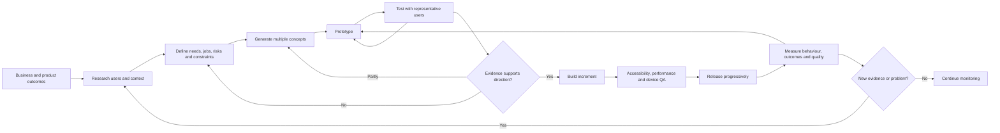
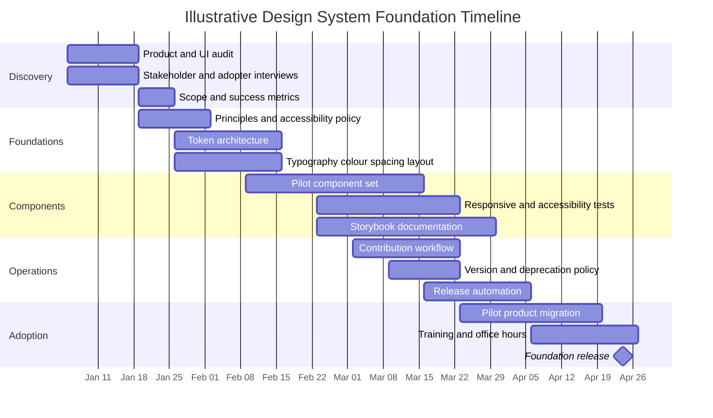

# Mobile and game design research

This page is a dated snapshot of research received in August 2026 on human-centred design,
mobile web, accessibility, design systems and tokens, mobile game UX, and analytics. It is
reproduced in full rather than rewritten, so it still reads as the survey it was, with its
own emphases, thresholds and dates. Some of those have already moved on.

Its findings were distilled into the [Design resource index](resource-index.md). That
index is the maintained directory of sources; this page is the argument behind it. Look a
source up there, and come back here for the reasoning that earned it a place. If a source
named on this page is missing from the index, add it to the index — this page is not
maintained, and it must not quietly become a second, drifting catalogue.

The report assumes a product with more surface than this repository has. Analytics,
experimentation and monetisation are all out of scope here: the hub
[collects nothing](../project/purpose-and-scope.md#what-it-deliberately-does-not-do) and
has no backend to sell through. Those sections are kept whole anyway, because the games
this repository serves may one day need them, and because the reasoning about evidence and
ethics is worth reading either way. Where the report and this repository disagree,
[Purpose and scope](../project/purpose-and-scope.md), the decision records and the Allium
specifications win.

Nothing here is a measurement taken in this repository. Every figure the report quotes —
the Core Web Vitals thresholds, the WCAG target sizes, the specification release dates —
is an inherited claim from the source the surrounding text names, and no check here
recomputes any of them.

## Executive summary

The strongest way to approach mobile web design is not as a sequence of screens, but as a
**continuous human-centred product-development loop**. Research establishes needs and
constraints, divergent exploration generates alternatives, prototypes make assumptions
testable, usability testing exposes failures, implementation adds technical constraints,
and production analytics reveal what happens at scale. ISO 9241-210 supplies the formal
human-centred foundation. The Design Council's Double Diamond gives teams an accessible
divergence/convergence model. GOV.UK's Service Manual turns those principles into
unusually practical research procedures across discovery, alpha, beta, and live service.

For mobile web specifically, four bodies of guidance deserve to be treated almost as
baseline infrastructure. **W3C WCAG 2.2 and WCAG2Mobile** for accessibility, **MDN** for
responsive layouts, input modalities, and browser behaviour, **web.dev/Core Web Vitals**
for user-perceived performance, and the **Apple/Android platform guidelines** for
interaction conventions that users bring with them from native applications. W3C
explicitly applies WCAG 2.2 guidance to mobile web, native, and hybrid applications.
Google currently defines "good" Core Web Vitals as LCP no more than 2.5 seconds, INP no
more than 200 ms, and CLS no more than 0.1.

A modern mobile-first strategy should be interpreted as **prioritising the essential
experience under constrained space, input, bandwidth, attention, and processing
conditions**, not as designing one 375-pixel screen and scaling it upwards. Luke
Wroblewski's *Mobile First* remains a seminal strategic argument, while Ethan Marcotte's
*Responsive Web Design* supplies the equally important implementation model of fluid
grids, flexible media, and media queries. Modern MDN guidance extends that thinking beyond
viewport width to touch, pointer precision, hover capability, and other environmental
properties.

A **design system is substantially more than a UI kit**. A useful working definition is:

> A design system is a governed, evolving set of reusable design decisions, foundations,
> tokens, components, patterns, implementation assets, documentation, and operating
> processes that enables multiple teams to create coherent, accessible, maintainable
> product experiences at scale.

That synthesis is consistent with Nielsen Norman Group's description of systems containing
components, patterns, styles, and guidelines, Atlassian's inclusion of guidelines,
foundations, tools, and components, and IBM Carbon's combination of working code, design
resources, human-interface guidance, and a contributor community.

For design systems, the most consequential recent development is the maturing of
**design-token interoperability**. The Design Tokens Community Group announced the first
stable version of its specification in October 2025, with implementations or support
across tools including Style Dictionary, Tokens Studio, Figma, Penpot, Sketch, Framer, and
others. Figma's variables now support capabilities such as theming modes, scoping,
references, and code syntax, while Style Dictionary can transform platform-agnostic tokens
into platform-specific representations.

Mobile game design needs all of the preceding disciplines, plus another layer: **gameplay
comprehension under cognitive and temporal pressure**. Mechanics must generate the
intended dynamics and player experience. Controls must disappear into play rather than
compete with it. HUD information must be perceptually prioritised. Onboarding should teach
only what matters when the player has enough attention to learn it. Monetisation should
not interrupt or deceptively manipulate play. Retention should be measured without turning
behavioural optimisation into coercive design. The MDA paper, Celia Hodent's game-UX work,
Microsoft's Xbox Accessibility Guidelines, Android's game-quality guidance, GDC case
studies, and game-analytics literature form a particularly strong reading stack.

For most teams, the highest-return sequence is therefore:

| Start here | Then add | Why |
| --- | --- | --- |
| ISO 9241-210 + Double Diamond + GOV.UK research | NN/g usability testing | Establish an evidence-driven design process. |
| WCAG 2.2 + WCAG2Mobile | Xbox/Game Accessibility Guidelines for games | Make accessibility a design constraint, not end-stage QA. |
| MDN responsive design | *Mobile First* + *Responsive Web Design* | Combine strategy with browser-level implementation knowledge. |
| web.dev Web Vitals | Lighthouse + PageSpeed Insights | Treat speed and responsiveness as UX requirements. |
| NN/g Design Systems 101 + *Atomic Design* | DTCG + Figma + Style Dictionary + Storybook | Progress from conceptual system architecture to production infrastructure. |
| MDA + *The Gamer's Brain* | GDC + Xbox XAGs + Game Analytics | Connect game mechanics, cognition, UI, accessibility, and telemetry. |
| Qualitative research | GA4/Firebase or PlayFab experimentation | Understand *why* before optimising *how much*. |

## Foundations and definitions

**Human-centred design.** ISO 9241-210 is the best formal anchor. It specifies
requirements and recommendations for human-centred activities throughout the lifecycle of
interactive systems, explicitly including websites, applications, and mobile devices. It
is more useful as a principles and governance reference than as a day-to-day methods
handbook. Pair it with the Design Council and GOV.UK for operational practice.

**Design thinking and Double Diamond.** The Design Council framework separates exploration
of the problem from exploration of solutions. Its delivery phase explicitly includes
small-scale testing, rejecting unsuccessful solutions, and improving promising ones. This
is a useful corrective to teams that treat "design" as producing a single polished mockup.

**User research.** GOV.UK provides one of the best free bodies of applied research
guidance available. Its Service Manual covers planning, recruitment, consent, research
with disabled participants, contextual research, interviews, moderated usability testing,
analysis, and the role of research in discovery through live service.

**Mobile-first design.** Mobile-first is most useful as a prioritisation principle. Start
with the smallest viable information hierarchy and interaction model, then progressively
exploit additional space and capabilities. Wroblewski's original work remains valuable
because it reframes mobile constraints as a forcing function for prioritisation rather
than treating mobile as a reduced desktop site. Marcotte's responsive-design work
complements it by showing how the interface can fluidly adapt across display sizes.

**Responsive versus adaptive design.** Responsive systems primarily allow layouts and
content to flow across available space through flexible layout primitives and conditional
CSS. Modern responsiveness should also account for input modality. MDN specifically
documents media queries such as `pointer` and `any-pointer`, which make it possible to
adapt interfaces according to input precision rather than assuming device type from screen
size.

**Progressive Web App.** A PWA is a web application that progressively uses web-platform
capabilities to provide app-like behaviour such as installation and offline operation
where supported. Support and installation behaviour remain platform-dependent. Current
web.dev documentation lists installability and offline capabilities on both iOS/iPadOS and
Android, while browser and operating-system behaviour differs.

**Design system versus neighbouring artefacts.** The distinctions below prevent a common
organisational failure, calling every Figma library a "design system." NN/g, Atlassian,
and Carbon all describe broader combinations of reusable assets, guidance, tools, and
people/processes.

| Artefact | What it primarily contains | What it usually does **not** provide |
| --- | --- | --- |
| **Style guide** | Brand, typography, colour, spacing, iconography, content conventions | Production components and operational governance |
| **Token library** | Named design decisions such as colour, spacing, typography, radius, elevation, motion | Complete UI behaviour and usage guidance |
| **Component library** | Reusable interface elements in design and/or code | Full product principles, pattern guidance, governance |
| **Pattern library** | Reusable solutions to recurrent interaction problems | Necessarily standardised code |
| **UI kit** | Design-tool representations of components | Production implementation, lifecycle, governance |
| **Design system** | Foundations + tokens + components + patterns + guidance + code/tooling + governance + contribution/release mechanisms | Nothing inherently. Scope depends on the organisation and products |

The difference matters operationally. A component library can become stale while
individual product teams continue shipping. A functioning design system needs an ownership
model, communication channels, contribution criteria, documentation, releases,
deprecations, and migration support. Atlassian publicly documents separate early-access,
beta, general-availability, intent-to-deprecate, and deprecated phases. Brad Frost
similarly treats design systems as living systems requiring maintainers, users,
governance, change processes, communication, training, and continued adaptation.

The following is a practical synthesis of ISO human-centred design, Double Diamond, GOV.UK
research practice, and iterative usability testing.



For games, add a recurring **playtest loop** inside the prototype/test stages. Test not
only whether a player can operate the interface, but whether the mechanics produce the
desired understanding, challenge, emotion, and behaviour. That is precisely the conceptual
bridge MDA was created to support.

## Prioritised resource map

The resources below are ordered roughly by practical leverage. **Essential** marks a
resource that belongs in a serious team's common curriculum. **Strong** marks one that is
highly valuable once the basics are established. **Specialist** marks one that is
especially important to a particular role or problem.

| Priority | Resource and URL | Scope | Level | Format | Cost | Annotation, key takeaway, and credibility |
| --- | --- | --- | --- | --- | --- | --- |
| **Essential** | **ISO 9241-210: Human-centred design for interactive systems**. <https://www.iso.org/standard/77520.html> | Process | Intermediate/Advanced | Standard | Paid standard; abstract free | The formal reference for lifecycle-wide human-centred design. Best for establishing principles, roles, and governance rather than specific workshop techniques. ISO is the primary standards authority. |
| **Essential** | **Design Council, Double Diamond**. <https://www.designcouncil.org.uk/resources/the-double-diamond/> | Process, ideation, iteration | Beginner/Intermediate | Framework/article | Free | An excellent shared vocabulary for divergence and convergence across problem and solution spaces. Explicitly includes testing, rejecting, and improving solutions. Primary source from the organisation that developed/popularised the framework. |
| **Essential** | **GOV.UK Service Manual: User Research**. <https://www.gov.uk/service-manual/user-research> | Research, testing, iteration | Beginner/Advanced | Guide/library | Free | Exceptionally practical material on research planning, recruitment, consent, interviewing, contextual research, usability testing, disabled participants, analysis, and continuous research. Maintained by the UK government's digital-service organisation. |
| **Essential** | **Nielsen Norman Group: Usability Testing 101**. <https://www.nngroup.com/articles/usability-testing-101/> | Testing | Beginner/Intermediate | Article | Free | Straightforward grounding in task-based usability evaluation. NN/g is one of the longest-standing practitioner authorities in usability and HCI. |
| **Essential** | **WCAG 2.2**. <https://www.w3.org/TR/WCAG22/> | Accessibility | All | W3C Recommendation | Free | The accessibility baseline for web products. Treat the success criteria as design requirements, not merely a compliance checklist for QA. W3C is the primary standards body. |
| **Essential** | **WCAG2Mobile**. <https://www.w3.org/TR/wcag2mobile-22/> | Mobile accessibility | Intermediate/Advanced | W3C guidance | Free | Explains application of WCAG 2.2 Level A and AA to native, mobile-web, and hybrid applications. Particularly useful for interpreting WCAG in mobile interaction contexts. |
| **Essential** | **MDN Responsive Web Design**. <https://developer.mozilla.org/en-US/docs/Learn_web_development/Core/CSS_layout/Responsive_Design> | Responsive layout, touch/input | Beginner/Intermediate | Guide/tutorial | Free | Practical browser-oriented reference spanning responsive layout and touch/pointer concerns. MDN is one of the strongest implementation references for open web technologies. |
| **Essential** | **web.dev: Web Vitals**. <https://web.dev/articles/vitals> | Performance UX | Intermediate | Guide | Free | Defines Core Web Vitals and current thresholds. Useful for making performance measurable in product and design acceptance criteria. |
| **Essential** | **Luke Wroblewski, Mobile First**. <https://mobile-first.abookapart.com/> | Mobile strategy | Beginner/Intermediate | Book | Free to read | The seminal strategic case for beginning with mobile constraints. Older implementation details should be supplemented with current MDN/browser guidance, but the prioritisation model remains highly valuable. |
| **Essential** | **Ethan Marcotte, Responsive Web Design**. <https://abookapart.com/products/responsive-web-design.html> | Responsive design | Beginner/Intermediate | Book | Paid | Foundational treatment of fluid grids, flexible images, and media queries. Seminal rather than current-browser-complete, so pair with MDN. |
| **Essential** | **NN/g: Design Systems 101**. <https://www.nngroup.com/articles/design-systems-101/> | Design-system definition and strategy | Beginner/Intermediate | Article | Free | One of the clearest conceptual introductions. Emphasises components, patterns, styles, guidelines, and the people who manage and implement them. |
| **Essential** | **Brad Frost, Atomic Design**. <https://atomicdesign.bradfrost.com/> | Components, pattern libraries, workflow, maintenance | Intermediate | Online book | Free to read | Highly influential model for thinking about interfaces as nested systems rather than isolated pages. Especially useful for bridging design and frontend implementation. |
| **Essential** | **Design Tokens Community Group**. <https://www.designtokens.org/> | Tokens/interoperability | Intermediate/Advanced | Specification/ecosystem | Free | The key standards effort for portable token data. Its first stable specification was announced in October 2025. Use it when creating a token architecture intended to outlive a single design tool. |
| **Essential** | **Storybook**. <https://storybook.js.org/> | Component build, documentation, testing | Intermediate/Advanced | Tool | Free/open source | Builds components in isolation and captures hard-to-reach states as stories. Excellent as the executable documentation layer of a web design system. Current site lists Storybook v10. |
| **Essential** | **Style Dictionary**. <https://styledictionary.com/> | Token transformation | Advanced | Tool/library | Free/open source | Converts platform-agnostic design decisions into representations needed by different platforms. Current documentation supports DTCG-style tokens as well as its legacy format. |
| **Strong** | **Alla Kholmatova, Design Systems**. <https://www.smashingmagazine.com/design-systems-book/> | System architecture, shared language | Intermediate | Book | Paid | Strong on the organisational and language dimensions of design systems, rather than treating tooling as the core problem. Published by Smashing Magazine. |
| **Strong** | **Semantic Versioning**. <https://semver.org/> | Versioning/release management | Intermediate/Advanced | Specification | Free | A sensible model for versioning component packages with explicit APIs. Major = incompatible change, minor = compatible functionality, patch = compatible fix. |
| **Essential** | **Apple Human Interface Guidelines**. <https://developer.apple.com/design/human-interface-guidelines> | Platform conventions | All | Official guidelines | Free | Essential for understanding interaction expectations carried over from iPhone and iPad, even when the product itself is web-based. Primary Apple source. |
| **Essential** | **Android quality and UX guidance**. <https://developer.android.com/quality/user-experience> | Mobile UX, adaptive UI, onboarding, accessibility, monetisation | All | Official guidelines | Free | Unusually useful because it covers both apps and games, including adaptive layouts, onboarding, accessibility, localisation, and monetisation timing. Updated July 29, 2026. |
| **Strong** | **web.dev Learn PWA**. <https://web.dev/learn/pwa/progressive-web-apps> | Installability, offline, app-like web | Intermediate | Course/guide | Free | Best starting point when the mobile web experience should operate beyond a traditional browser-tab model. Pair with MDN for API-level detail. |
| **Strong** | **Trustworthy Online Controlled Experiments**, Kohavi, Tang, Xu. <https://www.cambridge.org/core/books/trustworthy-online-controlled-experiments/D97B26382EB0EB2DC2019A7A7B518F59> | A/B testing | Intermediate/Advanced | Book | Paid | One of the strongest practical foundations for experimentation at scale. Much more rigorous than treating A/B testing as "ship two colours and compare clicks." |
| **Strong** | **Google Analytics events**. <https://support.google.com/analytics/answer/9322688> | Product analytics | Beginner/Intermediate | Official docs | Free | Useful starting point for event taxonomy. GA4 events can represent page loads, clicks, purchases, impressions, crashes, and other occurrences. |
| **Strong** | **Firebase A/B Testing**. <https://firebase.google.com/docs/ab-testing> | Experimentation | Intermediate | Tool/docs | Free tier + paid usage depending on services | Supports Remote Config experiments on Android, iOS, and web. Particularly practical for progressively exposing interface or feature variants. |

For **mobile game UX and game design**, a separate stack takes priority:

| Priority | Resource and URL | Scope | Level | Format | Cost | Annotation, key takeaway, and credibility |
| --- | --- | --- | --- | --- | --- | --- |
| **Essential** | **Hunicke, LeBlanc & Zubek, MDA: A Formal Approach to Game Design and Game Research**. <https://aaai.org/papers/ws04-04-001-mda-a-formal-approach-to-game-design-and-game-research/> | Mechanics, dynamics, player experience | Intermediate/Advanced | Academic paper | Free | Seminal framework connecting Mechanics, Dynamics, and Aesthetics. Particularly useful for reasoning backwards from desired player experience to mechanics and for diagnosing why a nominal "feature" changes actual play. Published through AAAI. |
| **Essential** | **Celia Hodent, The Gamer's Brain / Video Game UX and Psychology**. <https://celiahodent.com/video-game-ux-psychology/> | Cognition, HUD, onboarding, attention | Intermediate | Book + articles/talks | Article free; book paid | The best practitioner bridge between cognitive psychology and game UX. Strong on memory load, perceptual grouping, contextual HUD cues, attention, learning priorities, icon comprehension, and playtesting hypotheses. |
| **Essential** | **Hodent: UX of Onboarding and Player Engagement**. <https://celiahodent.com/gamers-brain-ux-onboarding/> | Onboarding, engagement | Intermediate | GDC talk/slides/article | Free article | Deep dive into one of the hardest game-UX problems. Valuable because it treats onboarding as learning design and cognitive-load management, not as a parade of modal tooltips. |
| **Essential** | **Microsoft Xbox Accessibility Guidelines**. <https://learn.microsoft.com/en-us/xbox/accessibility/guidelines> | Controls, UI, HUD, text, contrast, difficulty, narration | All | Official guidelines | Free | Probably the most comprehensive single official game-accessibility reference. Covers text, contrast, multimodal cues, subtitles, screen narration, input, difficulty, object clarity, haptics, UI navigation/focus/context, and more. |
| **Essential** | **Game Accessibility Guidelines**. <https://gameaccessibilityguidelines.com/> | Inclusive game UX | Beginner/Intermediate | Guideline library | Free | Highly practical checklist-style resource with real examples. Independent rather than a platform requirement, but established since 2012 and explicitly recommended in the IGDA Game Accessibility SIG's developer resources. |
| **Essential** | **Apple: Designing for Games**. <https://developer.apple.com/design/human-interface-guidelines/designing-for-games> | Mobile game interaction | Intermediate | Platform guideline | Free | Primary source for game-specific Apple interaction principles, including touchscreen control considerations for iPhone/iPad. |
| **Essential** | **Android: What a great user experience looks like**. <https://developer.android.com/quality/user-experience> | Onboarding, adaptive game UX, monetisation | All | Platform guideline | Free | Excellent mobile-game reference. Google explicitly advises integrating monetisation into the experience, not surprising users with payment requests or interrupting gameplay with poorly timed ads. |
| **Strong** | **MDN: Mobile touch controls for web games**. <https://developer.mozilla.org/en-US/docs/Games/Techniques/Control_mechanisms/Mobile_touch> | Browser-game controls | Intermediate | Tutorial | Free | Directly relevant to HTML/mobile web games. Useful implementation bridge between touch interaction design and actual browser code. |
| **Strong** | **GDC Vault free talks**. <https://gdcvault.com/free/gdc-24/> | Case studies, onboarding, retention, production | Intermediate/Advanced | Conference talks | Free subset | High-value source of practitioner case studies. The 2024 free archive includes Ubisoft's *Rainbow Six Siege* onboarding redesign and mobile game discovery/growth sessions. |
| **Strong** | **Rules of Play: Game Design Fundamentals**, Salen & Zimmerman. <https://mitpress.mit.edu/9780262240451/rules-of-play/> | Game systems, meaningful play, theory | Intermediate/Advanced | Book | Paid | A foundational, rigorous framework for thinking about games as designed systems. Still excellent conceptually, though it predates contemporary mobile F2P and web-platform patterns. MIT Press describes it as a theoretical guide for game scholars, developers, and interactive designers. |
| **Strong** | **Game Analytics: Maximizing the Value of Player Data**. <https://link.springer.com/book/10.1007/978-1-4471-4769-5> | Retention, telemetry, player behaviour | Advanced | Academic/practitioner book | Paid/institutional access | Comprehensive treatment of analytics across players, processes, and performance, with contributions from researchers and industry practitioners. Particularly useful for progressing beyond simplistic DAU/retention dashboards. |
| **Strong** | **PlayFab Experiments**. <https://learn.microsoft.com/en-us/xbox/playfab/live-service-management/game-configuration/experiments/> | Live-game experimentation | Intermediate/Advanced | Tool/docs | Service-dependent | Microsoft's experimentation tooling designed specifically for games. Useful for live tuning and feature experiments when paired with sound statistical practice. |
| **Specialist** | **ACM research on deceptive/dark patterns in mobile games**, a body of papers rather than one document | Monetisation ethics, retention | Advanced | Academic papers | Often institutional access | Important counterweight to purely revenue-driven F2P guidance. Recent studies examine temporal, monetary, social, and psychological deceptive patterns and how they affect player experience. |

The older books in these lists are intentionally included. Their value is **conceptual
durability**, not current API knowledge. *Mobile First*, *Responsive Web Design*, *Rules
of Play*, MDA, and *Atomic Design* should be paired with continuously maintained W3C, MDN,
Apple, Android, Storybook, DTCG, and browser documentation.

## Mobile web and game design practice

For **responsive layouts**, design around content and interaction requirements rather than
a catalogue of named devices. Use modern layout primitives, flexible sizing, sensible
maximum widths, content-dependent breakpoints, and explicit testing at narrow and wide
extremes. Do not assume a narrow viewport means touch or a large viewport means mouse. MDN
specifically documents pointer-related media features for adapting to input capabilities.

A practical responsive test matrix should include at least: a narrow phone viewport, a
larger phone, portrait and landscape states where relevant, tablet-sized layouts, enlarged
text, long/localised strings, zoom, software-keyboard-open states, low-end CPU/network
simulation, touch, coarse pointer, keyboard-only operation, and screen-reader paths. This
matrix is a synthesis of responsive, accessibility, and mobile-quality guidance rather
than a formal W3C-required device list. W3C's mobile guidance explicitly treats mobile-web
accessibility as an application of the same WCAG principles, while Android emphasises
adaptability across form factors.

For **touch**, WCAG 2.2's Level AA Target Size Minimum criterion establishes a 24 by 24
CSS-pixel baseline, subject to specified exceptions. WCAG's enhanced AAA target criterion
uses 44 by 44 CSS pixels. In product work, it is sensible to treat 24 CSS pixels as the
compliance floor and use larger targets where practical, particularly for high-frequency,
destructive, or time-sensitive controls.

Do not make hover the sole way to discover an action. Avoid tightly clustered controls,
ambiguous gesture-only commands, and interfaces that require pixel-precise dragging.
Provide a visible alternative when a gesture performs an important function. WCAG2Mobile
explicitly incorporates newer WCAG 2.2 criteria including dragging movements and target
size into mobile guidance.

For **motion**, respect system preferences such as `prefers-reduced-motion`, and
distinguish decorative animation from animation required to understand state changes. MDN
documents the reduced-motion media feature for detecting when users have requested
minimisation of non-essential movement.

For **performance**, make budgets part of design review. As of August 2026, Google's
published "good" Core Web Vitals thresholds remain LCP at or below 2.5 seconds, INP at or
below 200 milliseconds, and CLS at or below 0.1. These are user-experience metrics, not
merely engineering metrics. A visually sophisticated interaction that repeatedly pushes
INP into poor territory is a UX defect. An image strategy that creates late layout jumps
is a UX defect. A third-party marketing stack that consumes the main thread is a
product-design trade-off.

A useful mobile performance checklist is therefore:

| Check | Practical acceptance question |
| --- | --- |
| **LCP** | Does the primary visible content arrive quickly under representative mobile conditions? Target good-field performance of ≤2.5 s. |
| **INP** | Does tapping, typing, opening navigation, changing filters, and interacting with game/UI controls respond promptly? Target ≤200 ms. |
| **CLS** | Do late-loading fonts, ads, images, banners, and personalisation shift controls under the user's finger? Target ≤0.1. |
| **Image/media strategy** | Are dimensions reserved, formats appropriate, and offscreen assets deferred? |
| **JavaScript budget** | Is shipped JavaScript justified by user value, especially on lower-end phones? |
| **Third-party budget** | Are analytics, ads, consent managers, experimentation, and support widgets included in performance budgets? |
| **Network resilience** | Is the interface understandable on slow or intermittent networks? |
| **Loading UI** | Do skeletons/spinners accurately represent waiting rather than conceal it? |
| **Error/retry** | Can users recover from an interrupted request without restarting the entire task? |

Use **Lighthouse** for repeatable lab diagnostics and **PageSpeed Insights** for a
convenient view of lab plus available field performance data. Those tools should
supplement, not replace, observation of real users and production monitoring. Lighthouse
is an official Chrome tool for auditing performance, accessibility, and related quality
dimensions.

For **accessibility**, WCAG 2.2 should be the web baseline, but checking boxes against
WCAG after implementation is insufficient. Include disabled participants in research, test
keyboard and assistive-technology paths, preserve semantic structure, expose meaningful
states programmatically, keep focus visible, ensure error messages explain recovery, and
support zoom/reflow. GOV.UK explicitly includes guidance for research with disabled
people, and W3C's mobile note says WCAG2Mobile is informative guidance for applying WCAG
Level A and AA to mobile applications.

For **mobile-web platform strategy**, consider a PWA when installation, offline behaviour,
background-capable features, or app-like launching materially improve the experience. Do
not adopt PWA architecture just for the label. Capabilities and installation paths vary
between platforms and browsers, so progressive enhancement remains the correct underlying
principle. web.dev currently documents installable/offline PWA paths on both iOS/iPadOS
and Android.

For **game loops**, MDA is especially useful because it separates what the designer
specifies from what actually emerges in play. Mechanics are rules and capabilities.
Dynamics arise when those mechanics interact over time. Aesthetics describe the desired
experiential qualities. A "daily reward," energy meter, touch joystick, cooldown, combo
system, or currency sink cannot be judged only as an isolated component. Its consequences
for actual player dynamics are the thing that matters.

A practical game-loop canvas is:

| Layer | Questions |
| --- | --- |
| **Player goal** | What is the player trying to accomplish in the next 10 seconds, minute, session, and multi-session horizon? |
| **Action** | What meaningful choice or motor action do they make? |
| **System response** | How quickly and clearly does the game acknowledge it? |
| **Feedback** | What visual, audio, haptic, score, state, or narrative information changes? |
| **Learning** | What does the player now understand better? |
| **Reward/progression** | Is the reward intrinsically interesting, extrinsic, or both? |
| **Next decision** | Does the result create a clear, interesting next choice? |
| **Friction** | Is friction intentional challenge, or merely interface/cognitive overhead? |
| **Long loop** | How does this session contribute to mastery, progression, collection, social play, or narrative? |
| **Ethical check** | Is the loop engaging because the play is meaningful, or because the interface obscures cost, exploits urgency, or makes disengagement artificially difficult? |

For **onboarding**, Hodent's work is particularly practical. She recommends prioritising
what players actually need to learn, deciding the order and depth of teaching according to
the game's core pillars, and validating comprehension through playtesting. Her examples
also show why important instruction should not be delivered when the player's attention is
saturated by threat or other demanding action.

That implies an onboarding principle that is useful well beyond games: **teach in context,
but not at the moment of maximum cognitive load**. Do not explain six concepts before they
become meaningful. Do not interrupt a high-attention encounter with a tutorial card. Teach
the minimum required for the next meaningful action, observe whether the player succeeds,
then progressively introduce complexity. Android's current quality guidance similarly says
onboarding should be designed for the target audience and should account for both new and
expert users where relevant.

For the **HUD**, treat screen space as an attention budget. Hodent's examples emphasise
perceptual grouping, proximity, similarity, contextual controls, and reduction of memory
burden. Microsoft's current accessibility guidance goes further by treating HUD elements
such as health, objectives, hints, inventory, and maps as information that may also
require narration or alternate channels.

A HUD audit should ask:

| Area | Test |
| --- | --- |
| Importance | Is the most critical information also the easiest to perceive? |
| Proximity | Are values visually attached to the things they describe? |
| Persistence | Is information persistent because it must be remembered, or merely because "games have HUDs"? |
| Context | Can controls/prompts appear only when relevant? |
| Occlusion | Does the HUD obscure targets, hazards, or touch interaction areas? |
| Contrast | Is information legible over the worst possible gameplay background? Xbox explicitly covers HUD contrast. |
| Text | Does gameplay text remain readable, configurable, and understandable? Xbox explicitly includes HUD meters and instructional cues in its text guidance. |
| Alternative channels | Can essential visual information also use sound, haptics, narration, or other cues where appropriate? |
| Cognitive load | Can a first-time player accurately explain the HUD after playing, rather than merely saying that it "looks clear"? Hodent explicitly warns that players may report clarity without accurately understanding a HUD. |

For **controls**, minimise simultaneous demands and give players configuration where the
genre permits. Apple's game guidance explicitly recommends touch controls appropriate to
touchscreen play. Microsoft's XAG input guidance recommends support for digital and analog
UI navigation, single non-simultaneous presses where possible, remapping, updated prompts
after remapping, axis inversion, and alternatives to prolonged holds such as toggle
behaviour.

For a mobile web game, controls deserve device-realistic testing because thumb reach,
occlusion, browser chrome, orientation, viewport changes, multitouch behaviour, and
accidental page gestures can all differ from desktop simulation. MDN's mobile-touch game
tutorial is a good implementation starting point, but user testing on physical phones
remains necessary.

For **monetisation UX**, Android's primary guidance is unusually clear. Set expectations,
integrate monetisation into the experience, do not surprise people with payment requests
immediately after launch, and do not distract them with ads in the middle of a game level.
It also recommends careful control of ad timing, frequency, size, and placement to reduce
accidental taps.

Treat those principles as product-quality constraints even when you are building a browser
game rather than an Android binary. Academic work on deceptive design in mobile games
provides a useful warning that temporal, monetary, social, and psychological mechanics can
cross from engagement design into manipulative design.

For **retention**, avoid using a single retention curve as the definition of success. Pair
quantitative measures such as first-session completion, D1/D7-style return behaviour,
progression, failure points, and feature adoption with qualitative playtest evidence.
Game-analytics literature explicitly treats data about players, processes, and performance
across the game lifecycle as a broader discipline than a handful of business KPIs.

For **analytics**, instrument meaningful product and gameplay events rather than every DOM
event. Google Analytics defines events as interactions or occurrences such as page views,
link clicks, purchases, crashes, and impressions. For a game, a useful event taxonomy
typically follows player intent and state transitions: session start, tutorial step
reached, control first used, attempt started, success/failure, reward claimed, resource
spent, level abandoned, purchase surface viewed, purchase initiated/completed,
accessibility option changed, and session end. The specific taxonomy is a product-design
decision, not something GA4 dictates.

For **A/B testing**, begin with a falsifiable hypothesis, define one primary decision
metric plus guardrails, determine exposure before looking for winners, and avoid
repeatedly peeking and stopping as soon as a favourable result appears. Kohavi, Tang, and
Xu's *Trustworthy Online Controlled Experiments* is the recommended rigorous reference.
Firebase makes the mechanics accessible for web/mobile teams and explicitly supports
progressively exposing Remote Config variants to a percentage of users. PlayFab provides a
game-specific experimentation platform.

Crucially, **A/B testing should come after usability reasoning, not replace it**. An
experiment can tell you that variant B caused a measurable behaviour change. Interviews,
observation, playtests, and usability testing are usually better tools for discovering why
the change happened, what participants misunderstood, and whether a local metric
improvement damaged trust or comprehension elsewhere. The continuous-research model in
GOV.UK and the experimentation model are therefore complementary rather than competing
approaches.

## Building and operating a design system

A robust design-system programme should start with a **product problem**, not a request to
"standardise everything." NN/g explicitly notes that design systems make the most sense
when scale and replicability justify the resources and time required. Brad Frost similarly
recommends beginning with a suitable pilot, proving usefulness, then establishing
governance and a roadmap.

A strong sequence is:

**Audit and scope.** Inventory representative production screens, components, colours,
type styles, spacing values, interaction patterns, accessibility defects, duplicated code,
and local variants. Quantify where inconsistency creates actual cost: repeated
implementation, visual regressions, inaccessible controls, duplicated QA, or slow
design-to-development handoff.

**Define principles and foundations.** Establish accessibility policy, responsive
philosophy, content rules, typography, colour roles, spacing scale, layout grid, radii,
elevation, iconography, motion, focus behaviour, and platform divergence rules.

**Model design decisions as tokens.** Use names based on intent rather than raw appearance
where possible. DTCG provides the emerging interoperability format, while Style Dictionary
provides a practical transformation layer across implementations.

A useful hierarchy is:

```text
Primitive / reference tokens
    color.blue.600
    space.400
    radius.200
    font.size.300

Semantic tokens
    color.text.default
    color.text.danger
    color.surface.default
    color.border.focus
    space.layout.compact

Component tokens, only where needed
    button.primary.background.default
    button.primary.background.hover
    input.border.error
```

Avoid prematurely generating hundreds of component-specific tokens. The purpose of
semantic layers is to allow themes, brand changes, accessibility modes, and implementation
changes without forcing every product to depend directly on raw values. Figma's current
variable model supports aliases, themes/modes, scoping, and code syntax, making it a
reasonable design-side representation.

**Build components as complete behavioural contracts.** A "button" is not a rectangle plus
text. Its contract includes purpose, anatomy, permitted content, size variants, responsive
behaviour, default/hover/focus/active/disabled/loading states, keyboard behaviour, touch
behaviour, semantics, accessibility name, theming, localisation, analytics considerations
where relevant, and public code API.

IBM Carbon's component-contribution checklist is an unusually good real-world benchmark.
It requires tokenised colour/type/spacing, specified interaction states, responsive
behaviour, Storybook examples, documentation, typed APIs, and avoidance of untokenised
"magic" values.

**Document executable states.** Storybook is especially effective because a component can
be rendered in isolation and difficult states can be persisted as stories. That makes
documentation useful for design review, implementation, QA, accessibility review, visual
regression, and edge-case discussion rather than being a static gallery of ideal states.

**Establish governance before scale.** Decide who can propose a component, who reviews
design, accessibility, content, and code, which criteria make a pattern "system-worthy,"
and what happens when a product needs something that the core system does not support.
Brad Frost's governance writing emphasises direct communication between system makers and
system users, while his maintenance chapter distinguishes modifying, adding, and removing
patterns and stresses ongoing support/training.

**Release like infrastructure.** Component libraries should have explicit APIs and
predictable versioning. SemVer provides the clearest conventional model: patch for
backward-compatible fixes, minor for backward-compatible functionality, major for
incompatible API changes. Atlassian's release phases are a useful additional model for
communicating maturity and deprecation independently of package numbers.

**Deprecate rather than silently break.** Mark deprecated components, provide
replacements, migration guidance, codemods where feasible, and a removal horizon.
Atlassian's public lifecycle separates "intent to deprecate" from "deprecated," which
gives consuming teams time to plan.

**Measure adoption and outcomes.** Useful measures include percentage of product UI using
system components, duplicate variants retired, component accessibility failures, open
contribution requests, median contribution/review time, package-version fragmentation,
migration completion, visual regressions, documentation search failures, and
designer/developer satisfaction. The specific measures are organisational choices. The
important principle from NN/g and Frost is that a system is operated by people and must
continue evolving with its products and users.

The timeline below is an **illustrative 16-week foundation release**, not a universal
schedule. Large organisations or multi-brand/multi-platform systems may require
substantially longer. The order reflects the audit, pilot, token, component, governance,
and rollout practices represented in NN/g, Carbon, DTCG, Storybook, Atlassian, and Frost's
guidance.



The system should not be declared "finished" at the milestone. Frost's description of a
living system is the more realistic model: product adoption reveals gaps, users request
additions, accessibility and performance requirements evolve, platforms change, and
component APIs need maintenance.

A practical **component specification template** is:

| Field | Required content |
| --- | --- |
| Name and status | Canonical name, owner, Experimental/Beta/Stable/Deprecated |
| Purpose | Problem solved and situations where it should not be used |
| Anatomy | Named internal regions |
| Variants | Visual/functional variants and when each applies |
| Sizes | Available sizes and minimum touch behaviour |
| States | Default, hover, focus, pressed, selected, disabled, loading, error, success as applicable |
| Content | Label limits, truncation/wrapping, icon rules, localisation |
| Responsive behaviour | Reflow, width, overflow, touch versus pointer behaviour |
| Accessibility | Element semantics, accessible name, keyboard behaviour, focus, ARIA only where necessary |
| Motion | State transitions plus reduced-motion treatment |
| Tokens | All consumed semantic/component tokens |
| Code API | Props/attributes/events/slots and default values |
| Examples | Do, do not, edge states, real content |
| Testing | Unit, interaction, visual, accessibility, browser/device |
| Analytics | Events only if the component genuinely owns a system-level event |
| Change history | Added, changed, deprecated, migration notes |
| Ownership | Maintainer and contribution channel |

A simple **governance model** that works better than an opaque central committee is:

| Role | Responsibility |
| --- | --- |
| Core design-system team | Foundations, architecture, APIs, releases, documentation, quality gates |
| Accessibility/content specialists | Cross-cutting review and standards |
| Product contributors | Propose and often build needs discovered in real product work |
| Product adopters | Consume, report gaps, test migrations, supply usage evidence |
| Maintainers | Triage requests, decide core system versus product-local solution |
| Engineering/design leadership | Funding, staffing, product-system alignment, escalation |

The key is two-way contribution. Frost explicitly warns that a rigid system that fails to
adapt to users' real needs will drive teams towards alternatives, while uncontrolled
addition produces a bloated pattern library.

## Learning paths and practical templates

For an **individual product designer new to mobile web**, a six-stage progression is more
effective than starting in Figma:

| Stage | Study | Practical exercise |
| --- | --- | --- |
| Foundations | Double Diamond, GOV.UK user research, NN/g usability testing. | Interview 5 representative users around one real task. Turn observations into needs and risky assumptions. |
| Mobile strategy | *Mobile First* and *Responsive Web Design*. | Redesign one desktop flow from the smallest useful content hierarchy upwards. |
| Browser reality | MDN responsive design and pointer/touch documentation. | Build or pair with an engineer on a responsive prototype and test it on physical phones. |
| Accessibility | WCAG 2.2, WCAG2Mobile, WCAG Quick Reference. | Audit the prototype for focus, semantics, zoom, touch targets, reduced motion, and screen-reader use. |
| Performance | Web Vitals, Lighthouse, PageSpeed Insights. | Add LCP/INP/CLS targets to the design acceptance criteria. |
| Measurement | GA4 event model + experimentation fundamentals. | Create an event taxonomy and experiment brief before instrumenting anything. |

For a **design-system designer or frontend engineer**, use this progression:

| Stage | Core resources | Outcome |
| --- | --- | --- |
| Mental model | NN/g Design Systems 101 + *Atomic Design*. | Understand system versus component library and page-based versus component-based thinking. |
| Architecture | Kholmatova + Carbon + Atlassian. | Define principles, foundations, documentation model, and ownership. |
| Tokens | DTCG + Figma variables + Style Dictionary. | Create primitive and semantic token layers that can generate implementation artefacts. |
| Components | Carbon checklist + Storybook. | Produce fully specified, executable, testable components with edge states. |
| Operations | SemVer + Atlassian release phases + Frost governance. | Establish contribution, maturity, release, migration, and deprecation policy. |
| Adoption | Frost maintenance guidance + product pilot | Treat system consumers as users and continuously improve based on product adoption evidence. |

For a **mobile game UX designer**, the recommended path is different:

| Stage | Core resources | Practice |
| --- | --- | --- |
| Game systems | MDA + *Rules of Play*. | Decompose an existing mobile game's core loop into mechanics, resulting dynamics, and intended player experience. |
| Cognitive UX | Hodent, *The Gamer's Brain* material. | Audit HUD, menus, icon comprehension, memory demands, and attentional competition. |
| Onboarding | Hodent GDC onboarding + GDC case studies. | Build a learning inventory, rank it by importance, and test what players discover without tutorials. |
| Controls | Apple game guidance + MDN touch controls + Xbox XAG Input. | Prototype on physical devices. Test occlusion, reach, remapping, holds, sensitivity, and accidental input. |
| Accessibility | Xbox XAGs + Game Accessibility Guidelines. | Create an accessibility-settings prototype before polishing the primary HUD. |
| Monetisation ethics | Android quality guidance + dark-pattern research. | Review every purchase/ad/urgency moment for informed choice, accidental activation, interruption, and coercion. |
| Analytics | *Game Analytics* + PlayFab/Firebase + experimentation literature. | Instrument progression and comprehension hypotheses, not just revenue events. |

For a **cross-functional product team**, the most effective learning model is to apply
these resources to one pilot feature rather than distribute reading lists. Run research
together, observe usability sessions together, establish performance/accessibility
acceptance criteria, implement several components through the proposed design-system
workflow, release behind progressive exposure if appropriate, and review qualitative and
quantitative evidence together. GOV.UK explicitly structures user research across the
lifecycle, while Frost emphasises direct communication and collaborative relationships
between design-system makers and users.

A reusable **research brief**:

| Field | Template |
| --- | --- |
| Decision | What decision will this research inform? |
| Users | Who must we understand, including excluded/disabled/low-connectivity users? |
| Context | Where, when, and on what devices does the behaviour happen? |
| Known evidence | Analytics, support issues, prior research, competitive evidence |
| Risky assumptions | What are we currently assuming without evidence? |
| Research questions | Questions about behaviour and understanding, not "Do users like our idea?" |
| Method | Interviews, contextual inquiry, concept test, usability test, diary, survey, playtest |
| Prototype fidelity | Lowest fidelity that can answer the question |
| Recruitment | Inclusion/exclusion criteria and accessibility accommodations |
| Tasks | Realistic goals without telling participants which UI control to use |
| Measures | Success, failure, severity, comprehension, time only where meaningful |
| Evidence capture | Notes, recordings/consent, clips, behavioural observations |
| Decision rule | What evidence would make us proceed, change direction, or investigate further? |

This structure follows the practical research planning, recruitment, consent,
usability-testing, and analysis concerns covered by GOV.UK.

A reusable **mobile UX release checklist**:

| Area | Release question |
| --- | --- |
| Content | Is the primary purpose understandable immediately? |
| Hierarchy | Does priority survive narrow screens, enlarged text, and localisation? |
| Responsive | Does content reflow rather than simply shrink? |
| Touch | Are important targets comfortably operable and at least compliant with applicable WCAG target-size requirements? |
| Pointer | Is no essential function hover-only? |
| Keyboard | Can every interactive web control be reached and operated logically? |
| Focus | Is focus visible and not obscured? WCAG2Mobile incorporates WCAG 2.2's focus-related mobile guidance. |
| Zoom/text | Does increased text size preserve access to content/actions? WCAG 2.2 includes text-resizing requirements. |
| Motion | Is reduced motion respected? |
| Loading | Is progress/status understandable without unexpected layout movement? |
| Errors | Can a user understand and recover from errors? |
| Offline/network | What happens when latency spikes or a request fails midway? |
| LCP | Good-field target ≤2.5 s. |
| INP | Good-field target ≤200 ms. |
| CLS | Good-field target ≤0.1. |
| Analytics | Are events attached to meaningful user actions and outcomes? |
| Privacy | Is measurement proportional to the decision it supports? |
| Devices | Has the flow been tested on representative physical mobile hardware? |

A reusable **game UX playtest sheet**:

| Observe | Questions |
| --- | --- |
| First 30 seconds | Does the player know what they can do without explanation? |
| First meaningful action | How long until the player makes a consequential choice? |
| First success/failure | Do they understand *why* the outcome happened? |
| Controls | Where do fingers obscure the action? What is tapped by accident? What is forgotten? |
| HUD | Which elements are actually noticed? Can players explain them afterwards? Hodent warns that perceived clarity and true comprehension can differ. |
| Tutorial | Which instructions are ignored because attention is elsewhere? |
| Learning | What did players discover naturally and therefore does not need explicit teaching? |
| Cognitive load | Are players learning while simultaneously under high threat or input load? |
| Accessibility | Can controls be remapped or simplified where appropriate? Can important information use more than one channel? |
| Pause/interruption | Can a mobile interruption occur without losing progress or comprehension? |
| Monetisation | Does the player understand price, value, permanence, and consequence before committing? |
| Ad placement | Does an ad interrupt active gameplay or create accidental taps? Android explicitly advises against such patterns. |
| Return session | After time away, does the player remember the controls and current goal? |
| Fun versus friction | Is difficulty coming from the intended game challenge or from UI confusion? |
| Retention hypothesis | What intrinsic reason does the player have to return? What mechanic is supposed to support that? |

A reusable **experiment brief**:

```text
Decision:
What product decision will this experiment resolve?

Hypothesis:
For [population], changing [independent variable] from A to B
will improve [primary metric] because [causal reasoning].

Primary metric:
Exactly one principal decision metric where possible.

Guardrails:
Accessibility failures
Performance regressions
Error/crash rate
Task completion
Revenue/refund impact
Unsubscribe/uninstall/complaint signals
Other trust or quality measures

Population:
Eligibility criteria and unit of randomisation.

Exposure:
Planned percentage and ramp strategy.

Duration/sample:
Defined before interpreting the result.

Instrumentation:
Events and properties required for the analysis.

Segments:
Pre-specified groups worth checking.

Stopping rule:
When and under what conditions the test ends.

Decision rule:
Ship / reject / iterate / run follow-up.

Qualitative follow-up:
What interviews, usability tests, or playtests could explain the result?
```

This separates **hypothesis formation** from retrospective storytelling. Firebase provides
practical mechanics for controlled Remote Config exposure, while Kohavi and colleagues
provide the stronger statistical and organisational framework for trustworthy
experimentation.

## Tools, example systems, and source index

The following toolchain is a strong default. The exact implementation should be chosen
according to your technology stack rather than adopted wholesale.

| Tool/library | Primary use | Cost | URL | Why it is useful |
| --- | --- | --- | --- | --- |
| **Figma Variables** | Design-side tokens, themes, modes | Paid/free tiers depending on Figma plan | <https://help.figma.com/hc/en-us/articles/18490793776023-Update-1-Tokens-variables-and-styles> | Variables can reference other variables/styles, use multiple modes, scopes, and code syntax. |
| **DTCG specification/ecosystem** | Portable token model | Free | <https://www.designtokens.org/> | Best standards-oriented basis for avoiding proprietary token schemas. First stable version announced in 2025. |
| **Style Dictionary** | Transform tokens to CSS/platform outputs | Free/open source | <https://styledictionary.com/> | Platform-agnostic token transformation with DTCG compatibility. |
| **Storybook** | Component workshop, docs, states, testing | Free/open source | <https://storybook.js.org/> | Build components separately from product business logic and persist edge cases as stories. |
| **Semantic Versioning** | Library/package releases | Free | <https://semver.org/> | Clear contract for compatible and breaking changes. |
| **Lighthouse** | Lab performance/accessibility audits | Free | <https://developer.chrome.com/docs/lighthouse/overview> | Useful automated quality checks during implementation and CI. |
| **PageSpeed Insights** | Web performance diagnostics | Free | <https://pagespeed.web.dev/> | Convenient performance assessment tied to Google's web-performance ecosystem. |
| **WCAG Quick Reference** | Accessibility implementation reference | Free | <https://www.w3.org/WAI/WCAG22/quickref/> | Filterable implementation companion to WCAG. |
| **Chrome DevTools PWA tools** | Manifest, service worker, storage debugging | Free | <https://developer.chrome.com/docs/devtools/progressive-web-apps> | Useful when implementing installable/offline web experiences. |
| **Google Analytics 4** | Product/event analytics | Free/paid ecosystem | <https://support.google.com/analytics/answer/9322688> | Event-oriented measurement across web/app interactions. |
| **Firebase A/B Testing** | Web/mobile experiments | Service-dependent | <https://firebase.google.com/docs/ab-testing> | Remote Config experiments with web, Android, and iOS support. |
| **PlayFab Experiments** | Game experimentation | Service-dependent | <https://learn.microsoft.com/en-us/xbox/playfab/live-service-management/game-configuration/experiments/> | Game-specific controlled experimentation tooling. |
| **MDN Game Development** | Web-game APIs and controls | Free | <https://developer.mozilla.org/en-US/docs/Games> | Practical reference for HTML game technologies, controls, graphics, and browser APIs. |
| **Xbox Accessibility Guidelines** | Game UX accessibility | Free | <https://learn.microsoft.com/en-us/xbox/accessibility/guidelines> | Broad official framework covering UI, control, perception, narration, difficulty, and feedback. |
| **Game Accessibility Guidelines** | Practical inclusive game checklist | Free | <https://gameaccessibilityguidelines.com/> | Concrete examples and implementation-oriented recommendations. |

The best **public design systems to study** are not simply the prettiest. Study how they
explain decisions, expose implementation, deal with accessibility, define tokens, manage
component maturity, and support contributors.

| Design system | URL | Best things to study |
| --- | --- | --- |
| **U.S. Web Design System** | <https://designsystem.digital.gov/> | Accessibility, mobile friendliness, component guidance, patterns, public-sector constraints, progressive enhancement. USWDS explicitly describes itself as helping teams build accessible, mobile-friendly federal websites. |
| **Material Design 3** | <https://m3.material.io/> | Mobile foundations, adaptive components, interaction patterns, theming, tokens, Android alignment. It remains Google's primary public design-system reference. |
| **IBM Carbon** | <https://carbondesignsystem.com/> | Enterprise-scale system architecture, code libraries, Figma assets, contribution criteria, accessibility, documentation. Carbon defines itself as an open-source system containing code, design tools/resources, HCI guidance, and community. |
| **Atlassian Design System** | <https://atlassian.design/> | Foundations, components, release maturity, governance, contribution, enterprise product consistency. Its public model explicitly combines guidelines, foundations, tools, and components. |
| **Adobe Spectrum** | <https://spectrum.adobe.com/> | Cross-platform design language, inclusive interaction, complex creative/productivity applications. Adobe maintains Spectrum as its public design-system reference. |
| **Microsoft Fluent 2** | <https://fluent2.microsoft.design/> | Cross-platform foundations, tokens, component architecture, Microsoft ecosystem conventions. |
| **Salesforce Lightning Design System 2** | <https://www.lightningdesignsystem.com/> | Large enterprise component ecosystems, CRM/data-heavy interfaces, mature system operations. |
| **Shopify Polaris** | <https://shopify.dev/docs/api/polaris> | Commerce and admin UX, cross-surface consistency, web components. Shopify currently describes Polaris as its unified UI framework across app surfaces, built on web components. |

For **design-system teams**, Carbon is probably the most useful system to reverse-engineer
at component level because its public contribution criteria expose requirements that many
systems keep internal: token usage, interaction states, responsiveness down to small
widths, Storybook examples, documentation, typed APIs, localisation, and implementation
quality. Atlassian is particularly valuable for learning release maturity and deprecation.
USWDS is unusually valuable for accessibility and mobile-friendly public-service patterns.

For **mobile product designers**, Material, Apple HIG, Android's design/quality guidance,
WCAG2Mobile, and USWDS form a useful comparative set. Do not blindly import a native
component into a web application because it "looks mobile." Use the platform guidelines to
understand user expectations, then implement those expectations with semantic, responsive
web primitives.

For **mobile game teams**, the strongest overall reference stack is MDA for systemic
reasoning, Hodent for cognitive UX and onboarding, Xbox XAGs plus Game Accessibility
Guidelines for inclusive controls/HUD/UI, Apple and Android for platform expectations, GDC
Vault for production case studies, *Game Analytics* for telemetry, and rigorous
experimentation literature for live optimisation.

Finally, the most important distinction across this entire resource set is between
**principles that age slowly and implementation guidance that ages quickly**.
Human-centred design, iterative testing, meaningful game mechanics, perceptual/cognitive
constraints, accessibility, modular system thinking, and statistically sound
experimentation are relatively durable. Browser capabilities, framework APIs, design
tools, platform conventions, PWA behaviour, performance tooling, and component-library
versions change continuously. Use seminal books and papers to construct your mental model,
but use W3C, MDN, web.dev, Apple, Android, Microsoft, DTCG, and current tool documentation
as the source of truth when deciding how to ship today.

## Related pages

- [Design resource index](resource-index.md) — the maintained directory of these sources.
- [Design direction](direction.md) — the platform's own decisions about appearance.
- [Accessibility](../explanation/accessibility.md) — how this material is applied here.
- [Purpose and scope](../project/purpose-and-scope.md) — what the hub does not do.
